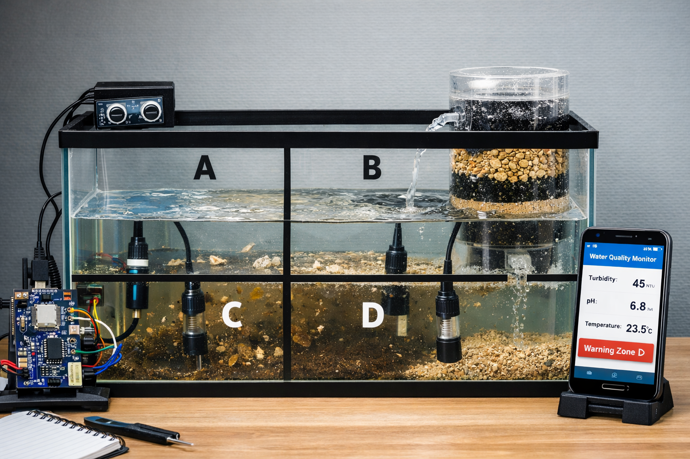

# Equipo 02 - Fundamentos de Diseño
### Carrera de Ingeniería Ambiental / Informática / Industrial  
**Universidad Peruana Cayetano Heredia**

---

## 🌍 Descripción del Equipo  

Somos el <strong>Equipo 02</strong> del curso <strong>Fundamentos de Diseño 2026-1</strong>, conformado por estudiantes de la carrera de Ingeniería Ambiental / Informática / Industrial.  
Nuestro objetivo es aplicar la metodología de diseño para generar soluciones innovadoras con impacto social, tecnológico y ambiental.

---

## 🎯 Introducción

La ciudad de Lima, particularmente en distritos como Villa María del Triunfo, presenta una marcada desigualdad en el acceso a recursos básicos, siendo el agua potable uno de los más críticos. En las zonas altas y asentamientos humanos, el abastecimiento es irregular, costoso y, en muchos casos, dependiente de camiones cisterna, lo que limita el desarrollo y la calidad de vida de la población.

Paradójicamente, Lima posee una alta humedad ambiental, especialmente durante temporadas de garúa y neblina, recurso que no es aprovechado de manera eficiente. A ello se suma un segundo problema relevante: la contaminación del aire, producto del crecimiento urbano, el tránsito vehicular y la presencia de polvo en zonas no pavimentadas.

En este contexto, el presente proyecto propone el diseño de un sistema inteligente de captación de niebla con monitoreo de calidad del aire, que permita no solo generar una fuente alternativa de agua, sino también evaluar las condiciones ambientales del entorno. Esta propuesta integra principios de ingeniería, sostenibilidad y tecnología, orientándose a soluciones adaptadas a la realidad local.

---

## ⚠️ Problemática

En las zonas altas de Villa María del Triunfo y otros sectores periurbanos de Lima se identifican dos problemáticas principales:

### 1. Escasez de agua  
- Más de un millón de personas en Lima no cuentan con acceso adecuado al agua potable.  
- Existe dependencia de camiones cisterna, lo que implica **altos costos y baja continuidad del servicio**.  
- Se generan limitaciones en actividades básicas como higiene, riego y consumo.  

### 2. Contaminación del aire  
- Presencia de material particulado (PM2.5 y PM10), especialmente en zonas con alta exposición al polvo.  
- Emisión de gases contaminantes debido al tránsito vehicular y actividades urbanas.  
- Impacto directo en la salud, principalmente enfermedades respiratorias.  

### 🔍 Problema integrador  

A pesar de la abundante humedad ambiental presente en forma de neblina o garúa, no existen sistemas accesibles que permitan aprovechar este recurso como fuente alternativa de agua y, simultáneamente, evaluar la calidad del aire del que proviene.

Esto genera una doble brecha:

- Se desperdicia un recurso natural disponible (neblina).  
- No se cuenta con información clara sobre la calidad del aire en zonas vulnerables.  

---

## 💡 Presentación de la solución  

El presente proyecto propone el desarrollo de un <strong>sistema inteligente de captación de niebla con monitoreo de calidad del aire</strong>, diseñado para zonas vulnerables de Lima, como Villa María del Triunfo, donde existe limitada disponibilidad de agua potable y altos niveles de contaminación ambiental.

La solución se basa en el aprovechamiento de la humedad atmosférica en forma de neblina o garúa, la cual es transformada en agua mediante un sistema de captación física. A diferencia de los sistemas tradicionales de atrapanieblas, esta propuesta incorpora un componente tecnológico que permite evaluar la calidad del aire, generando información ambiental relevante.

El sistema está compuesto por tres módulos principales:

### 🔹 Módulo 1: Captación de niebla  
- Uso de una malla especializada donde las microgotas se adhieren.  
- Coalescencia de gotas hasta alcanzar un tamaño suficiente.  
- Descenso por gravedad hacia una canaleta.  
- Almacenamiento en un depósito.  

### 🔹 Módulo 2: Monitoreo ambiental  
- Integración de sensores (ej. MQ-135 o PM2.5).  
- Detección de gases y partículas contaminantes.  
- Visualización del nivel de calidad del aire mediante LED o pantalla.  

### 🔹 Módulo 3: Registro y análisis  
- Medición del volumen de agua recolectada.  
- Registro del tiempo de captación.  
- Relación entre condiciones ambientales y rendimiento del sistema.  

Desde el enfoque de ingeniería, la solución integra principios de <strong>transferencia de masa (condensación)</strong>, diseño estructural optimizado (ángulo e inclinación de la malla) y sistemas electrónicos basados en sensores y microcontroladores. Esto permite no solo la captación eficiente del recurso hídrico, sino también la generación de datos para análisis y toma de decisiones.

El valor diferencial del proyecto radica en su enfoque integral: no solo busca generar una fuente alternativa de agua, sino también garantizar que dicha agua provenga de un entorno ambiental evaluado, incorporando un criterio de calidad que no está presente en sistemas convencionales.

En términos de impacto, esta solución representa una alternativa sostenible, de bajo costo y replicable, que puede ser implementada en comunidades con condiciones similares, contribuyendo simultáneamente a la <strong>seguridad hídrica</strong> y al <strong>monitoreo ambiental urbano</strong>.

---

## 🎯 Objetivos de Desarrollo Sostenible (ODS)

- 🚰 **ODS 6: Agua limpia y saneamiento**  
  Nuestro proyecto busca desarrollar una alternativa de captación hídrica aprovechando la humedad atmosférica presente en forma de niebla o garúa, especialmente en zonas vulnerables donde el acceso al agua es limitado, intermitente o costoso.

- ❤️ **ODS 3: Salud y bienestar**  
  La propuesta incorpora monitoreo de calidad del aire, debido a que la presencia de contaminantes atmosféricos afecta directamente la salud de la población, sobre todo en zonas urbanas expuestas al polvo y emisiones vehiculares.

- 🏗️ **ODS 9: Industria, Innovación e Infraestructura**  
  El sistema integra diseño estructural, sensores y análisis de datos, convirtiéndose en una propuesta tecnológica orientada a la innovación y al desarrollo de soluciones funcionales para problemáticas reales.

- 🏙️ **ODS 11: Ciudades y comunidades sostenibles**  
  El proyecto está pensado para contextos urbanos y periurbanos de Lima, planteando una solución adaptada a las condiciones ambientales y sociales de comunidades con limitada infraestructura de servicios básicos.

- 🌱 **ODS 13: Acción por el clima**  
  La propuesta promueve el aprovechamiento sostenible de recursos atmosféricos y fomenta medidas de adaptación frente a condiciones de escasez hídrica y deterioro ambiental.

---

## 📸 Fotografía del prototipo

  
   
  <em>Figura 1. Representación del prototipo propuesto</em>

---

## 📚 Proyectos similares

A continuación, se presentan proyectos y desarrollos tecnológicos relacionados con la captación de niebla, el monitoreo ambiental y el uso de sensores inteligentes. Estas referencias permiten contextualizar la propuesta del equipo y evidenciar el aporte diferencial del sistema planteado.

| 📸 Imagen | 🧠 Proyecto | 📄 ¿De qué trata? | 🔗 Enlace |
|:---:|:---|:---|:---:|
|  | **Sistema de captación de niebla** | Propuesta basada en mallas atrapanieblas para recolectar agua a partir de la humedad del ambiente en zonas con escasez hídrica. | [Ver proyecto](https://ejemplo.com) |
|  | **Monitoreo de calidad del aire con sensores** | Sistema que emplea sensores para detectar gases y material particulado, permitiendo evaluar la calidad del aire en tiempo real. | [Ver proyecto](https://ejemplo.com) |
|  | **Monitoreo IoT de variables ambientales** | Solución tecnológica que integra sensores conectados a plataformas digitales para registrar y visualizar datos ambientales. | [Ver proyecto](https://ejemplo.com) |
|  | **Sistema de alerta ambiental urbana** | Proyecto que utiliza sensores y módulos electrónicos para advertir cambios críticos en condiciones del entorno. | [Ver proyecto](https://ejemplo.com) |
|  | **Atrapanieblas con enfoque sostenible** | Diseño experimental orientado a captar agua de la niebla y proponer soluciones replicables en comunidades vulnerables. | [Ver proyecto](https://ejemplo.com) |

A diferencia de los proyectos presentados, la propuesta del equipo integra en un solo sistema la captación de agua atmosférica y el monitoreo de calidad del aire, lo que permite una solución más completa, innovadora y adaptada a la realidad de Lima.

---

## 📸 Fotografía del Equipo  

 
<em>Figura 2. Fotografía del equipo 02</em>

---

## 👥 Integrantes del Equipo  

| 📸 Foto | 👤 Nombre | 🎓 Rol | 💡 Intereses | 📧 Correo |
|:---:|:---|:---:|:---|:---|
|  | **Rodriguez Zavaleta, Valeria Nicole** | 👑 Líder del equipo | 🌱 Innovación social, 💡 liderazgo, ♻️ sostenibilidad | 📩 [valeria.rodriguez@upch.pe](mailto:valeria.rodriguez@upch.pe) |
|  | **Perez Salvatierra, María Fernanda** | 🔬 Investigación | 🌍 Gestión ambiental, 🌱 desarrollo sostenible, 📊 impacto ambiental | 📩 [maria.perez.salvatierra@upch.pe](mailto:maria.perez.salvatierra@upch.pe) |
|  | **Canchari de la Cruz, Ayme** | 🎨 Diseño | 🧩 prototipos, ✨ innovación, 🎯 creatividad aplicada | 📩 [ayme.canchari@upch.pe](mailto:ayme.canchari@upch.pe) |
|  | **Mamani Tello, Jose Antonio** | 📝 Documentación | 📄 procesos, 📈 mejora continua, ✍️ redacción técnica | 📩 [jose.mamani.t@upch.pe](mailto:jose.mamani.t@upch.pe) |
|  | **Espinola Abanto, Rosita Dayana** | 💻 Programación | 👩‍💻 programación, 📊 datos, 🧠 simulación y sistemas robóticos | 📩 [rosita.espinola@upch.pe](mailto:rosita.espinola@upch.pe) |

---

## 📌 Resumen Final  

El presente README describe la conformación del equipo, la problemática abordada y la propuesta de solución desarrollada en el marco del curso Fundamentos de Diseño. El proyecto propone un sistema inteligente que capta agua de la neblina mediante una malla atrapanieblas y, simultáneamente, monitorea la calidad del aire mediante sensores ambientales. Esta solución, aplicada en zonas como Villa María del Triunfo, permite aprovechar la humedad del ambiente como fuente alternativa de agua y evaluar las condiciones del aire del que proviene, integrando sostenibilidad, tecnología e innovación en un solo sistema.

