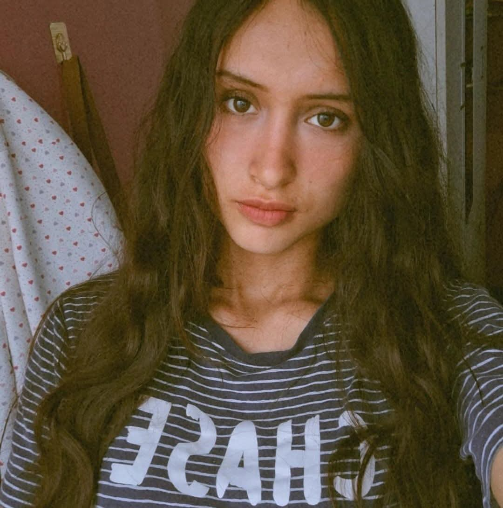

# Equipo 2X - Fundamentos de Diseño
### Carrera de Ingeniería Ambiental / Informática / Industrial  
**Universidad Peruana Cayetano Heredia**

---

## 🌍 Descripción del Equipo  
Somos el **Equipo 02** del curso **Fundamentos de Diseño 2026-1**, conformado por estudiantes de la carrera de Ingeniería Ambiental / Informática / Industrial.  
Nuestro objetivo es aplicar la metodología de diseño para generar soluciones innovadoras con impacto social, tecnológico y ambiental.  

Nos interesa trabajar en los siguientes **Objetivos de Desarrollo Sostenible (ODS):**  
- ODS 3: Salud y Bienestar
- ODS 9: Industria, Innovación e Infraestructura    
- ODS 13: Acción por el Clima  

---

## 📸 Fotografía del Equipo  

  <em>Figura 1. Fotografía del equipo 0X</em>

---

## 👥 Integrantes del Equipo  

| Foto | Nombre | Rol | Intereses |
|------|--------|-----|-----------|
|  | **Rodriguez Zabaleta, Valeria Nicol** | Líder del equipo | Innovación social, sostenibilidad |
|  | **Perez Salvatierra, María Fernanda** | Responsable de investigación | Gestión ambiental, desarrollo comunitario |
|  | **Canchari de la Cruz, Ayme** | Diseñadora | Diseño de prototipos, creatividad aplicada |
|  | **Mamani Tello, Jose Antonio** | Encargado de documentación | Comunicación científica, redacción técnica |
|  | **Espinola Abanto, Rosita Dayana** | Programadora - Modeladora | Programación, análisis de datos, simulación |

---

## 📌 Resumen Final  
Este README resume quiénes somos, qué nos motiva y en qué ODS queremos enfocar nuestro trabajo durante el curso.  
