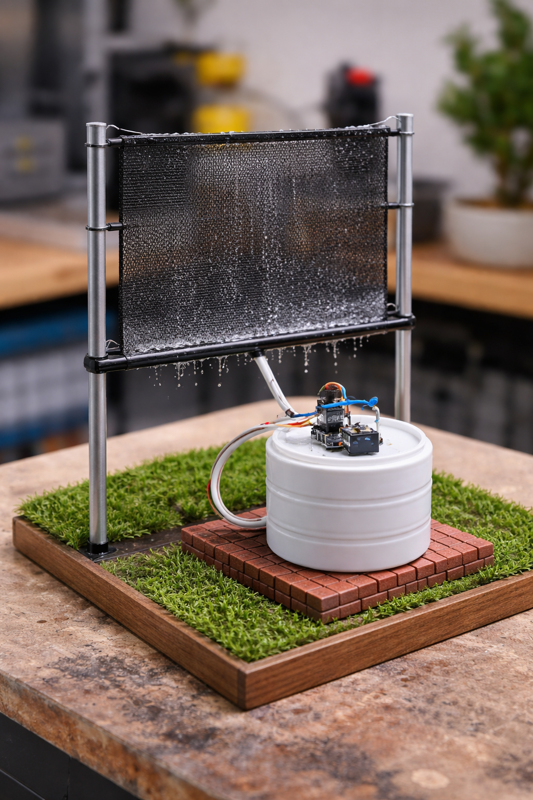
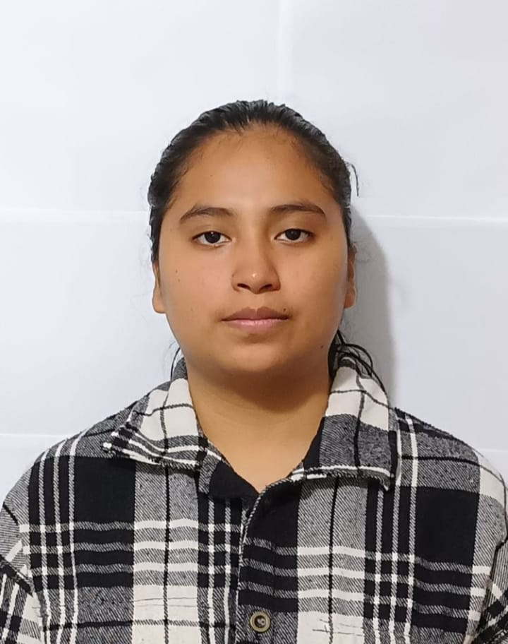

# Equipo 02 - Fundamentos de Diseño
### Carrera de Ingeniería Ambiental / Informática / Industrial  
**Universidad Peruana Cayetano Heredia**

---

## 🌍 Descripción del Equipo  

Somos el <strong>Equipo 02</strong> del curso <strong>Fundamentos de Diseño 2026-1</strong>, conformado por estudiantes de la carrera de Ingeniería Ambiental / Informática / Industrial.  
Nuestro objetivo es aplicar la metodología de diseño para generar soluciones innovadoras con impacto social, tecnológico y ambiental.

---

## 🎯 Introducción

La ciudad de Lima, particularmente en distritos como Villa María del Triunfo, presenta una marcada desigualdad en el acceso a recursos básicos, siendo el agua potable uno de los más críticos. En las zonas altas y asentamientos humanos, el abastecimiento es irregular, costoso y, en muchos casos, dependiente de camiones cisterna, lo que limita el desarrollo y la calidad de vida de la población.

Paradójicamente, Lima posee una alta humedad ambiental, especialmente durante temporadas de garúa y neblina, recurso que no es aprovechado de manera eficiente. A ello se suma un segundo problema relevante: la contaminación del aire, producto del crecimiento urbano, el tránsito vehicular y la presencia de polvo en zonas no pavimentadas.

En este contexto, el presente proyecto propone el diseño de un sistema inteligente de captación de niebla con monitoreo de calidad del aire, que permita no solo generar una fuente alternativa de agua, sino también evaluar las condiciones ambientales del entorno. Esta propuesta integra principios de ingeniería, sostenibilidad y tecnología, orientándose a soluciones adaptadas a la realidad local.

---

## ⚠️ Problemática

En las zonas altas de Villa María del Triunfo y otros sectores periurbanos de Lima se identifican dos problemáticas principales:

### 1. Escasez de agua  
- Más de un millón de personas en Lima no cuentan con acceso adecuado al agua potable.  
- Existe dependencia de camiones cisterna, lo que implica **altos costos y baja continuidad del servicio**.  
- Se generan limitaciones en actividades básicas como higiene, riego y consumo.  

### 2. Contaminación del aire  
- Presencia de material particulado (PM2.5 y PM10), especialmente en zonas con alta exposición al polvo.  
- Emisión de gases contaminantes debido al tránsito vehicular y actividades urbanas.  
- Impacto directo en la salud, principalmente enfermedades respiratorias.  

### 🔍 Problema integrador  

A pesar de la abundante humedad ambiental presente en forma de neblina o garúa, no existen sistemas accesibles que permitan aprovechar este recurso como fuente alternativa de agua y, simultáneamente, evaluar la calidad del aire del que proviene.

Esto genera una doble brecha:

- Se desperdicia un recurso natural disponible (neblina).  
- No se cuenta con información clara sobre la calidad del aire en zonas vulnerables.  

---

## 💡 Presentación de la solución  

El presente proyecto propone el desarrollo de un <strong>sistema inteligente de captación de niebla con monitoreo de calidad del aire</strong>, diseñado para zonas vulnerables de Lima, como Villa María del Triunfo, donde existe limitada disponibilidad de agua potable y altos niveles de contaminación ambiental.

La solución se basa en el aprovechamiento de la humedad atmosférica en forma de neblina o garúa, la cual es transformada en agua mediante un sistema de captación física. A diferencia de los sistemas tradicionales de atrapanieblas, esta propuesta incorpora un componente tecnológico que permite evaluar la calidad del aire, generando información ambiental relevante.

El sistema está compuesto por tres módulos principales:

### 🔹 Módulo 1: Captación de niebla  
- Uso de una malla especializada donde las microgotas se adhieren.  
- Coalescencia de gotas hasta alcanzar un tamaño suficiente.  
- Descenso por gravedad hacia una canaleta.  
- Almacenamiento en un depósito.  

### 🔹 Módulo 2: Monitoreo ambiental  
- Integración de sensores (ej. MQ-135 o PM2.5).  
- Detección de gases y partículas contaminantes.  
- Visualización del nivel de calidad del aire mediante LED o pantalla.  

### 🔹 Módulo 3: Registro y análisis  
- Medición del volumen de agua recolectada.  
- Registro del tiempo de captación.  
- Relación entre condiciones ambientales y rendimiento del sistema.  

Desde el enfoque de ingeniería, la solución integra principios de <strong>transferencia de masa (condensación)</strong>, diseño estructural optimizado (ángulo e inclinación de la malla) y sistemas electrónicos basados en sensores y microcontroladores. Esto permite no solo la captación eficiente del recurso hídrico, sino también la generación de datos para análisis y toma de decisiones.

El valor diferencial del proyecto radica en su enfoque integral: no solo busca generar una fuente alternativa de agua, sino también garantizar que dicha agua provenga de un entorno ambiental evaluado, incorporando un criterio de calidad que no está presente en sistemas convencionales.

En términos de impacto, esta solución representa una alternativa sostenible, de bajo costo y replicable, que puede ser implementada en comunidades con condiciones similares, contribuyendo simultáneamente a la <strong>seguridad hídrica</strong> y al <strong>monitoreo ambiental urbano</strong>.

---

## 🎯 Objetivos de Desarrollo Sostenible (ODS)

- 🚰 **ODS 6: Agua limpia y saneamiento**  
  Busca garantizar el acceso universal al agua segura; sin embargo, esta meta aún no se cumple en zonas vulnerables de Lima como Villa María del Triunfo. En Perú, solo alrededor del 49% de la población tiene acceso a agua potable gestionada de manera segura, y en Lima cerca de 1,7 millones de personas no están conectadas a la red de agua potable. En distritos como VMT, muchas familias —especialmente en zonas altas— dependen de camiones cisterna, pagando precios más altos por agua de menor calidad, lo que evidencia una fuerte desigualdad en el acceso al recurso hídrico y limita su uso adecuado para consumo, higiene y salud.  

  Frente a esta problemática, el proyecto de sistema inteligente de captación de niebla con monitoreo de calidad del aire se adapta directamente a la realidad de Villa María del Triunfo. Aprovecha la alta humedad (garúa) característica de Lima para generar una fuente alternativa de agua, contribuyendo al cumplimiento del ODS 6 mediante el uso de recursos naturales disponibles. Además, al integrar sensores de calidad del aire, permite evaluar contaminantes presentes en el entorno que podrían afectar el agua recolectada, lo que fortalece la seguridad del sistema y su impacto en la salud de la población. De esta manera, el proyecto no solo propone una solución sostenible e innovadora, sino también una alternativa viable para reducir la vulnerabilidad hídrica y mejorar la calidad de vida en comunidades con acceso limitado a servicios básicos.

---

- ❤️ **ODS 3: Salud y bienestar**  
  Poner fin a las enfermedades transmitidas por el agua (Meta 3.3). Según UNICEF, en todo el mundo más de 1.000 niños menores de cinco años mueren cada día por enfermedades relacionadas con el mal manejo del agua. Por ello, incluir sensores de calidad de agua se vuelve de vital importancia. El Informe Técnico del Congreso de la República (2012) resalta que el monitoreo es indispensable para garantizar que el agua captada cumpla con los estándares de potabilidad, debido a la alta carga de sedimentos atmosféricos en la zona. De esta manera, se asegura que el recurso captado esté libre de contaminantes o patógenos antes de su consumo, previniendo enfermedades diarreicas y parasitosis.  

  Monitoreo de la calidad del aire (Meta 3.9). El proyecto no solo proporciona agua, sino que también mide el entorno. Al integrar sensores de calidad del aire, se obtendrán datos críticos para prevenir enfermedades respiratorias. El ODS 3 busca reducir sustancialmente el número de muertes y enfermedades producidas por aire contaminado. El sistema actúa como una estación de alerta temprana para la salud comunitaria. Villa María del Triunfo es uno de los distritos con mayor humedad y, a menudo, con altos índices de contaminación por su cercanía a zonas industriales y tráfico. La niebla puede concentrar contaminantes; por ello, medir el aire mientras se captura el agua es vital.  

  Reducción de la carga de estrés y salud mental. En pleno 2026, miles de familias en el Cono Sur de Lima, como las más de 3000 en Villa María del Triunfo, enfrentan una crónica escasez de agua que se extiende por más de dos décadas, recibiendo el recurso apenas una vez por semana y obligándolas a pagar tarifas exorbitantes por camiones cisterna. La salud no es solo la ausencia de enfermedad, sino un estado de bienestar completo. En comunidades donde el agua debe acarrearse por largas distancias —una tarea física extenuante que suele recaer en mujeres y niños— este sistema reduce el agotamiento físico y el estrés asociado a la inseguridad hídrica. El bienestar mejora cuando la comunidad tiene autonomía sobre su recurso.

---

- 🏗️ **ODS 9: Industria, innovación e infraestructura**  
  Este objetivo promueve el desarrollo de infraestructura resiliente, la industrialización sostenible y el fomento de la innovación. En muchas zonas vulnerables de Lima, la infraestructura para el acceso al agua es limitada o inexistente, lo que genera dependencia de sistemas informales como los camiones cisterna.  

  Frente a esta situación, el proyecto propone una solución innovadora que integra diseño estructural, sensores y análisis de datos. El sistema combina un mecanismo físico de captación de niebla con tecnologías como microcontroladores y monitoreo en tiempo real, permitiendo no solo recolectar agua, sino también optimizar su funcionamiento mediante el análisis de variables ambientales.  

  De esta manera, se desarrolla una propuesta tecnológica orientada a la innovación y al desarrollo de soluciones funcionales para problemáticas reales, promoviendo infraestructura alternativa sostenible, accesible y replicable en otras zonas con condiciones similares.

---

- 🏙️ **ODS 11: Ciudades y comunidades sostenibles**  
  Busca mejorar las ciudades frente al rápido crecimiento urbano. Actualmente, más de la mitad de la población vive en zonas urbanas y se proyecta que esta cifra alcanzará el 70 % para el año 2050, lo que generará problemáticas como la contaminación del aire, la expansión desordenada y el acceso limitado a servicios básicos. Además, cerca de 1100 millones de personas viven en condiciones precarias, y muchas ciudades continúan creciendo más rápido en territorio que en población, provocando un uso ineficiente del suelo. Ante este panorama, el ODS 11 propone construir ciudades más sostenibles, resilientes, seguras e inclusivas.  

  En este contexto, como equipo se desarrollará el proyecto “Sistema inteligente de captación de niebla con monitoreo de calidad del aire para Lima”, el cual buscará responder a problemáticas reales de la ciudad. Por un lado, se propondrá captar agua a partir de la humedad ambiental, con el objetivo de contribuir al acceso a un recurso básico en zonas vulnerables. Por otro lado, se incorporarán sensores que permitirán monitorear la calidad del aire, facilitando la identificación de niveles de contaminación. De esta manera, el proyecto integrará sostenibilidad, uso eficiente de recursos e innovación tecnológica, con la finalidad de aportar a la mejora de la calidad de vida en entornos urbanos y fortalecer el desarrollo de ciudades más sostenibles.

---

- 🌱 **ODS 13: Acción por el clima**  
  Hemos escogido este ODS porque nuestro proyecto busca responder a problemas relacionados con el cambio climático en Lima, especialmente en zonas como Villa María del Triunfo, donde hay presencia de neblina, alta humedad y contaminación del aire.  

  En las zonas de lomas de Villa María del Triunfo existe alta humedad debido a la neblina, pero este recurso no es aprovechado, a pesar de la escasez de agua en sectores cercanos. Además, la contaminación del aire en Lima afecta el ambiente y la salud, siendo un problema relacionado con el cambio climático. Según datos estadísticos de SENAMHI, en Lima se registran contaminantes como PM2.5 y PM10 en niveles que pueden ser perjudiciales para la salud. Asimismo, la humedad relativa puede alcanzar entre 70% y 90%, lo que evidencia el potencial de captar agua de la niebla.

---

## 📸 Fotografía del prototipo

  
   
  <em>Figura 1. Representación del prototipo propuesto</em>

---

## 📚 Proyectos similares

A continuación, se presentan proyectos reales relacionados con la captación de niebla y el monitoreo ambiental. Estas referencias permiten contextualizar la propuesta del equipo y evidenciar su aporte innovador.

| 📸 Imagen | 🧠 Proyecto | 📄 ¿De qué trata? | 🔗 Enlace |
|:---:|:---|:---|:---:|
|  | **Atrapanieblas en el desierto de Atacama** | Sistema implementado en Chile que utiliza mallas para recolectar agua de la niebla, abasteciendo comunidades en zonas áridas. | [Ver proyecto][(https://www.fogquest.org/projects/chile/](https://www.heliosmx.org/atrapanieblas-en-el-desierto-de-atacama/)) |
|  | **Fog Water Collection System (MIT)** | Investigación del MIT que optimiza la captación de agua mediante superficies especiales inspiradas en la naturaleza. | [Ver proyecto](https://news.mit.edu/2013/efficient-fog-harvesting-0423) |
|  | **Sistema de monitoreo de calidad del aire con sensores IoT** | Proyecto basado en sensores que mide gases y partículas en el aire en tiempo real mediante plataformas digitales. | [Ver proyecto](https://github.com/openaq/openaq) |

A diferencia de los proyectos presentados, nuestra propuesta integra en un solo sistema la captación de agua atmosférica y el monitoreo de calidad del aire, generando una solución más completa, innovadora y adaptada a la realidad de Lima.

---

## 📚 Referencias

- Organización Mundial de la Salud (OMS). (2021). *Air Quality Guidelines*.  
  https://www.who.int/publications/i/item/9789240034228  

- Organización Mundial de la Salud (OMS). (2021). *What are the WHO Air Quality Guidelines*.  
  https://www.who.int/news-room/feature-stories/detail/what-are-the-who-air-quality-guidelines  

- United Nations. (2023). *The Sustainable Development Goals Report 2023*.  
  https://unstats.un.org/sdgs/report/2023/  

- United Nations. (2023). *Informe de los Objetivos de Desarrollo Sostenible*.  
  https://unstats-un-org.translate.goog/sdgs/report/2023/_x_tr_sl=en&_x_tr_tl=es&_x_tr_hl=es&_x_tr_pto=tc  

- Naciones Unidas Perú. (s.f.). *Objetivo de Desarrollo Sostenible 6: Agua limpia y saneamiento*.  
  https://peru.un.org/es/sdgs/6  

- United Nations Environment Programme (UNEP). (2019). *Air Pollution Report*.  
  https://unhabitat.org/world-cities-report-2020-the-value-of-sustainable-urbanization  

- World Bank. (2020). *Sustainable Cities Report*.  
  https://www.unep.org/resources/assessment/air-pollution-asia-and-pacific-science-based-solutions  

- UNICEF. (s.f.). *Día Mundial del Agua: 1.000 niños mueren cada día por falta de agua potable*.  
  https://www.unicef.es/noticia/dia-mundial-del-agua-1000-ninos-mueren-cada-dia-por-falta-de-agua-potable  

- Servicio Nacional de Meteorología e Hidrología del Perú (SENAMHI). (2022). *Calidad del aire en Lima Metropolitana*.  
  https://www.senamhi.gob.pe  

- Servicio Nacional de Meteorología e Hidrología del Perú (SENAMHI). (2025). *Reporte de condiciones climáticas y calidad del aire en Lima*.  
  https://www.senamhi.gob.pe  

- Superintendencia Nacional de Servicios de Saneamiento (SUNASS). (2023). *Familias sin acceso al agua potable gastan más que hogares conectados*.  
  https://www.gob.pe/institucion/sunass/noticias/848884  

- Ministerio de Vivienda, Construcción y Saneamiento. (2024). *Proyectos de agua y saneamiento en Villa María del Triunfo*.  
  https://www.gob.pe/vivienda  

- FogQuest. (2020). *Fog Collection Projects*.  
  https://www.fogquest.org  

- MIT News. (2013). *Fog harvesting system inspired by nature*.  
  https://news.mit.edu/2013/efficient-fog-harvesting-0423  

- UCSS. (s.f.). *Contaminación del aire en Villa María del Triunfo*.  
  https://es.scribd.com/document/495390114/informe-villa-maria-docx  

- Congreso de la República del Perú. (2012). *Informe técnico: Captación de agua de las nieblas: Una alternativa para el desarrollo de las zonas áridas*. Centros de Documentación y Biblioteca.  
  https://www2.congreso.gob.pe/sicr/cendocbib/con4_uibd.nsf/B0F868A4B8BAE93705257CBC004FA71A/$FILE/1_INFORME_TECNICO_FINAL.pdf
 
  ---

## 📸 Fotografía del Equipo  

 
<em>Figura 2. Fotografía del equipo 02</em>

---

## 👥 Integrantes del Equipo  

| 📸 Foto | 👤 Nombre | 🎓 Rol | 💡 Intereses | 📧 Correo |
|:---:|:---|:---:|:---|:---|
|  | **Rodriguez Zavaleta, Valeria Nicole** | 👑 Líder del equipo | 🌱 Innovación social, 💡 liderazgo, ♻️ sostenibilidad | 📩 [valeria.rodriguez@upch.pe](mailto:valeria.rodriguez@upch.pe) |
|  | **Perez Salvatierra, María Fernanda** | 🔬 Investigación | 🌍 Gestión ambiental, 🌱 desarrollo sostenible, 📊 impacto ambiental | 📩 [maria.perez.salvatierra@upch.pe](mailto:maria.perez.salvatierra@upch.pe) |
|  | **Canchari de la Cruz, Ayme** | 🎨 Diseño | 🧩 prototipos, ✨ innovación, 🎯 creatividad aplicada | 📩 [ayme.canchari@upch.pe](mailto:ayme.canchari@upch.pe) |
|  | **Mamani Tello, Jose Antonio** | 📝 Documentación | 📄 procesos, 📈 mejora continua, ✍️ redacción técnica | 📩 [jose.mamani.t@upch.pe](mailto:jose.mamani.t@upch.pe) |
|  | **Espinola Abanto, Rosita Dayana** | 💻 Programación | 👩‍💻 programación, 📊 datos, 🧠 simulación y sistemas robóticos | 📩 [rosita.espinola@upch.pe](mailto:rosita.espinola@upch.pe) |

---

## 📌 Resumen Final  

El presente README describe la conformación del equipo, la problemática abordada y la propuesta de solución desarrollada en el marco del curso Fundamentos de Diseño. El proyecto propone un sistema inteligente que capta agua de la neblina mediante una malla atrapanieblas y, simultáneamente, monitorea la calidad del aire mediante sensores ambientales. Esta solución, aplicada en zonas como Villa María del Triunfo, permite aprovechar la humedad del ambiente como fuente alternativa de agua y evaluar las condiciones del aire del que proviene, integrando sostenibilidad, tecnología e innovación en un solo sistema.

